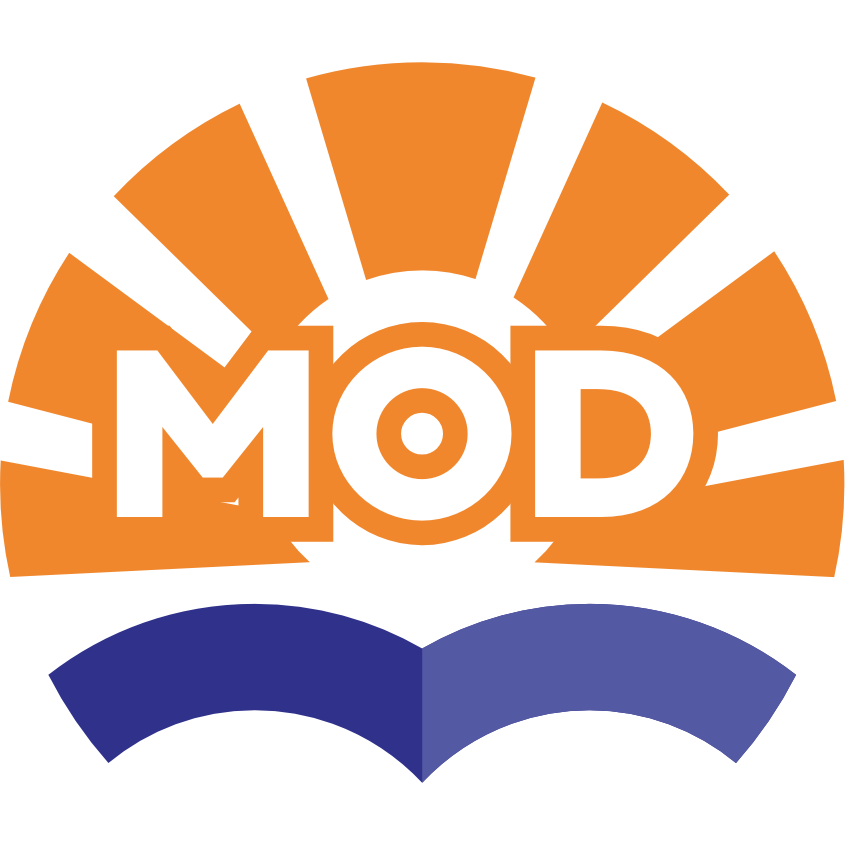

  

# MENTARI MOD

### ✨ *Manajemen Terpadu Pembelajaran Daring UNPAM yang Ditingkatkan* ✨

## 🚀 Tentang Proyek

**MENTARI MOD** adalah sebuah ekstensi browser yang dirancang untuk memperkaya dan memaksimalkan pengalaman belajar pada platform **MENTARI (*Manajemen Terpadu Pembelajaran Daring*)** Universitas Pamulang. Ekstensi ini menambahkan serangkaian fitur canggih yang tidak tersedia secara *default*, mengubah cara mahasiswa berinteraksi dengan sistem pembelajaran daring.

Dengan antarmuka modern berkonsep **"Glassmorphism"**, akses fitur yang lebih cepat, dan integrasi kecerdasan buatan (AI), MENTARI MOD bertujuan untuk membuat proses belajar menjadi lebih efisien, produktif, dan menyenangkan.

-----

## 💎 Fitur Unggulan

MENTARI MOD hadir dengan berbagai fitur yang dirancang untuk membantu mahasiswa.

### 🧩 **Peningkatan Antarmuka & Produktivitas**

  - **Dashboard Terpusat**: UI modern untuk melihat forum aktif, notifikasi balasan dosen, daftar mahasiswa, dan membuat catatan pribadi untuk setiap mata kuliah.
  - **Manajemen Kelompok**: Bagikan mahasiswa ke dalam kelompok secara acak atau berurutan dengan mudah.
  - **Rekap Presensi**: Lihat ringkasan dan detail persentase kehadiran semua mata kuliah dalam satu tabel interaktif tanpa perlu membuka halaman KHS.
  - **Auto Login**: *Username* dan *password* terisi otomatis di halaman login MENTARI dan MyUNPAM.
  - **Desain Modern**: Tampilan antarmuka yang lebih segar dan elegan dengan efek "Glassmorphism".

### 🤖 **Asisten AI & Otomatisasi**

  - **🤖 Gemini Assistant**: Chatbot AI terintegrasi untuk menjawab pertanyaan, menjelaskan materi, dan menyalin soal dari halaman kuis atau forum.
  - **✅ Bantuan Kuis Otomatis**: Selesaikan kuis secara otomatis dengan jawaban yang dianalisis oleh AI.
  - **📝 Bantuan Forum Diskusi**: Dapatkan rangkuman atau jawaban untuk topik diskusi dosen dan buat pertanyaan relevan dengan sekali klik.
  - **📋 Pengisian Kuesioner Cepat**: Isi kuesioner dosen dan survei KHS secara otomatis dengan berbagai mode pilihan (Setuju, Acak, atau berdasarkan rating).

-----

<!-- ## 📦 Instalasi

### 📺 **Video Tutorial**

<a href="[https://youtu.be/4CDs7ZwEq0c](https://youtu.be/4CDs7ZwEq0c)" target="_blank">

Klik untuk menonton tutorial instalasi lengkap

</a>

 -->

### **💻 Windows/macOS (Browser Berbasis Chromium)**

> Langkah-langkah ini berlaku untuk Google Chrome, Microsoft Edge, Brave, dll.

1.  Unduh file **`MentariEnhancer_v6.2.zip`** dari [halaman rilis terbaru](https://github.com/AnandaAnugrahHandyanto/mentari_unpam-mod/releases/latest).
2.  Ekstrak file `.zip` tersebut ke sebuah folder.
3.  Buka browser Anda dan navigasi ke `chrome://extensions/`.
4.  Aktifkan **"Mode Pengembang"** (Developer Mode) di pojok kanan atas.
5.  Klik tombol **"Muat yang belum dibuka"** (Load unpacked) dan pilih folder tempat Anda mengekstrak file tadi.
6.  Ekstensi siap digunakan\! ✨

### **📱 Android & iOS (Mises Browser)**

1.  Unduh **Mises Browser** dari App Store atau Play Store.
2.  Buka Mises Browser, unduh file **`MentariEnhancer_v6.2.zip`**.
3.  Ketuk menu (tiga titik) dan pilih **"Extensions"**.
4.  Aktifkan **"Developer Mode"**.
5.  Klik **"+ (from .zip/.crx/.user.js)"** dan pilih file `.zip` yang sudah diunduh.
6.  Refresh halaman MENTARI untuk melihat perubahannya\! ✨

-----

## ❓ FAQ (Tanya Jawab)

<b>🔒 Apakah ekstensi ini aman digunakan?</b>

Ya, ekstensi ini aman. Kami tidak mengumpulkan data pribadi. Semua proses berjalan di sisi klien (browser Anda). Permintaan ke API Google Gemini hanya dilakukan saat Anda menggunakan fitur AI dan memerlukan kunci API pribadi Anda, yang disimpan secara terenkripsi di browser Anda.

<b>🔑 Mengapa saya memerlukan Kunci Aktivasi dan Kunci API Gemini?</b>

  - <b>Kunci Aktivasi</b> diperlukan untuk verifikasi awal dan memastikan penggunaan ekstensi sesuai dengan ketentuan.
  - <b>Kunci API Gemini</b> dari Google AI Studio diperlukan untuk mengaktifkan semua fitur berbasis AI. Kunci ini gratis untuk penggunaan standar. Tutorial untuk mendapatkannya tersedia di dalam ekstensi.
    

    

<b>🔄 Bagaimana cara memperbarui ekstensi?</b>

Untuk memperbarui, hapus ekstensi versi lama dari halaman `chrome://extensions/`, lalu unduh dan instal versi terbaru dengan mengikuti langkah-langkah instalasi di atas. Pemberitahuan pembaruan juga akan muncul di dalam dasbor MENTARI MOD.

<b>🐞 Menemukan bug atau punya ide fitur baru?</b>

Kami sangat menghargai kontribusi Anda! Silakan buat laporan bug atau ajukan permintaan fitur baru melalui halaman <a href="[https://github.com/AnandaAnugrahHandyanto/mentari_unpam-mod/issues](https://github.com/AnandaAnugrahHandyanto/mentari_unpam-mod/issues)"><b>Issues</b></a> di GitHub.

-----

## 📄 Lisensi

Proyek ini dilisensikan di bawah **MIT License**. Lihat file [LICENSE](https://www.google.com/search?q=LICENSE) untuk informasi lebih lanjut.

-----

Dibuat dengan ❤️ untuk seluruh mahasiswa Universitas Pamulang

| **Pengembang Utama** | **Kontributor Backend & Logika** |
| :---: | :---: |
| **Lukman Muludin** | **Ananda Anugrah H** |
| )  |   |

© 2025 <a href="[https://instagram.com/_.chopin](https://instagram.com/_.chopin)">Lukman Muludin</a>. All Rights Reserved.

